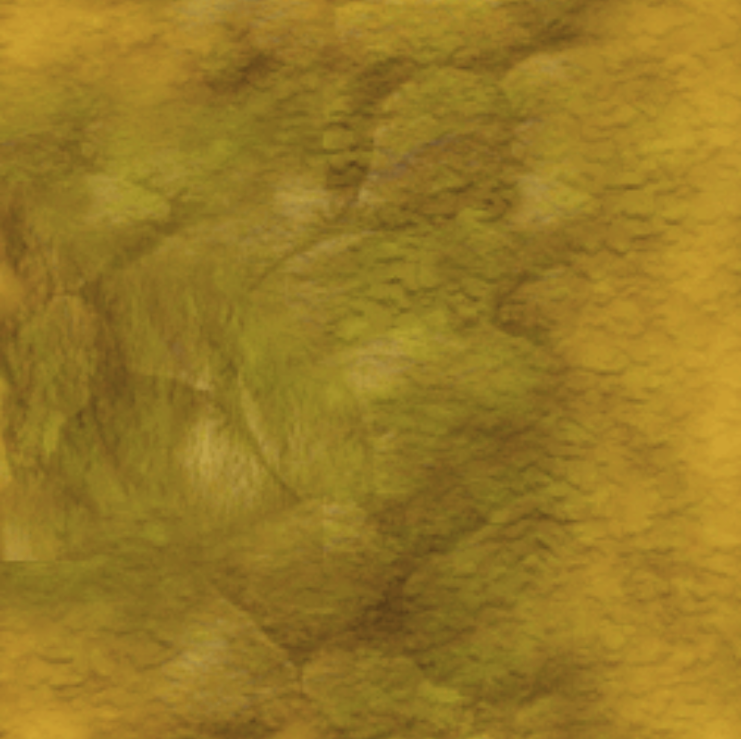
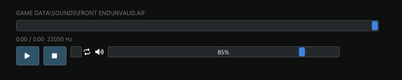

# Lego Racers 2 Exporter
Browse the contents of Lego Racers 2. Included features:
- Search and filter the internal files
- Render and preview the models, textures & animations.
- Load and preview levels
- Export models to FBX or GLB.
- Export textures.
- Export audio files.
- Export animations.
- Export level.

## How to use
- Acquire a legitimate copy of Lego Racers 2.
- Download Lego Racers 2 Explorer.exe and run it.
- Browse to your installation and select the GTC file!

## Preview

Here is a preview of a Balverine in Fable 2 Asset Browser:

Here is a preview of an Oak Tree:

Skeleton preview is also available!

You can mess around rotating bones; animations work too!

Quick sample of a Hobbe in blender!

And here is an example of some textures:

Audio playback controls:

## How to Contribute

There are several key areas where your contributions would be most impactful:

1. **Bug Reporting**: Please report any identified bugs in the issue tracker. Before reporting, ensure the bug hasn't been reported previously. Provide screenshots, details, or screen recordings if necessary.

2. **Code Reorganization**: The project could benefit from code reorganization to enhance readability and performance.

3. **Feature Requests and Other Contributions**: If you have a new feature or suggestion, please share it via the issue tracker.

### Submitting Changes

Follow these steps to submit your changes:

1. Fork the repository on GitHub.
2. Create a new branch on your forked repository.
3. Make your changes on this new branch.
4. Push the changes to your fork.
5. Submit a pull request to the 'main' branch.

    